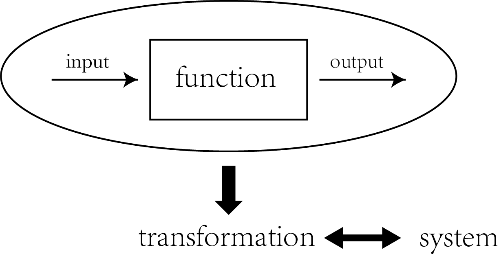
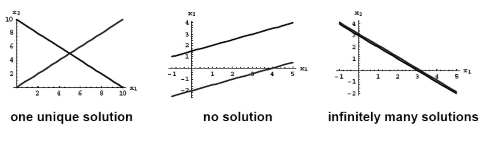

# Linear Algebra

## Preface

### Linear system

sestem: A system has input and output (function, transformation, operation)

### Linear transformation

1. Persevering multiplication

    $x \longrightarrow linear\ transformation \longrightarrow y$			 $kx \longrightarrow linear\ transformation \longrightarrow ky$

2. Persevering addition

    $x \longrightarrow linear\ transformation \longrightarrow y$

    $a \longrightarrow linear\ transformation \longrightarrow b$

    $x+a \longrightarrow linear\ transformation \longrightarrow y+b$

    

### Linear system (When the input and output are vectors)

1. Persevering multiplication

    $\begin{bmatrix}
    x \\
    y \\
    z
    \end{bmatrix} \longrightarrow linear\ transformation \longrightarrow \begin{bmatrix}
    a \\
    b \\
    \end{bmatrix}$			 

    

    $k\begin{bmatrix}
    x \\
    y \\
    z
    \end{bmatrix} \longrightarrow linear\ transformation \longrightarrow k\begin{bmatrix}
    a \\
    b \\
    \end{bmatrix}$

2. Persevering addition

    $\begin{bmatrix}
    x \\
    y \\
    z
    \end{bmatrix} \longrightarrow linear\ transformation \longrightarrow \begin{bmatrix}
    a \\
    b \\
    \end{bmatrix}$

    

    $\begin{bmatrix}
    o \\
    p \\
    q
    \end{bmatrix} \longrightarrow linear\ transformation \longrightarrow \begin{bmatrix}
    m \\
    n \\
    \end{bmatrix}$

    

    $\begin{bmatrix}
    x \\
    y \\
    z
    \end{bmatrix}+\begin{bmatrix}
    o \\
    p \\
    q
    \end{bmatrix} \longrightarrow linear\ transformation \longrightarrow \begin{bmatrix}
    a \\
    b \\
    \end{bmatrix}+\begin{bmatrix}
    m \\
    n \\
    \end{bmatrix}$

    

$\Delta$ : $x \longrightarrow transformation \longrightarrow x^2$ is not a linear transformation

1. $(kx)^2 = k^2x^2 \neq kx^2$
2. $(x+y)^2 \neq x^2 + y^2$

$\Delta$ : Some linear transformation

- Perivative is linear transformation 
- Intergral is linear transformatioalled, 0 to remove and 2 not upgraded.
n 

## Chapter 1 Linear Equation in Linear Algebra

### 1.1 System of Linear Equations

- **Equation**: An equation is a mathametical statement that assert the equality of two expressions

- **Linear Equation**: A linear equation in the veriables $x_1,\ x_2,\ \ldots,\ x_n$ is an equation that can be written in the form $$a_1x_1 + a_2x_2 + \cdots + a_nx_n = b$$

    Where $b$  and the coefficients $a_1,\ a_2,\ \ldots,\ a_n$ are real numbers, usually known in advanced.

- **System of Linear Equations (Linear System)**: A collection of over or more linear equations involving the same veriables, say  $x_1,\ x_2,\ \ldots,\ x_n$

    > An example is $\begin{cases} 3x_1 + 5x_2 - 4x_3 = 5 \\ 2x_1 + \ \ \ \ \ \ +2x_3 = 1 \end{cases}$

- **Linear equation in $n$ veriables/unknowns**

    $a_1x_1 + a_2x_2 + \cdots + a_nx_n = b\ \Longrightarrow\ a_{11}x_1 + a_{12}x_2 + \cdots + a_{1n}x_n = b$

- **System of $m$ Linear equations in $n$  unknowns**

    $\begin{cases} a_{11}x_1 + a_{12}x_2 + \cdots + a_{1n}x_n = b_1 \\ a_{21}x_1 + a_{22}x_2 + \cdots + a_{2n}x_n = b_2 \\ \vdots \\ a_{n1}x_1 + a_{n2}x_2 + \cdots + a_{nn}x_n = b_n \end{cases}$

    we call it a $m\times n$ ($m$ by $n$) linear system

A system of linear equation is said to be consitent if it has either one solution or infinitely many solutions; a system is inconsitent if it has no solution.

- **Solution set** $\Longleftrightarrow$ the collection of solution(s) of a system 

- **Geometric Interpretation of system of linear equations ****

    

- **Basic Fact**: A system of linear equations has either

    (i) exactly one solution (consitent) or 

    (ii) infinitely many solutions (consitent) or

    (iii) no solution (inconsistent)

- **Equivalent system**: Two systems involving the same variables are equivalent if they have the same solution set.
- A system is characterised by its **solution set**
- **Eliminations (obtain an equation system)** elementary row operation
    1. interchange
    2. scaling 
    3. repalacement

- **Echelon form**
- 