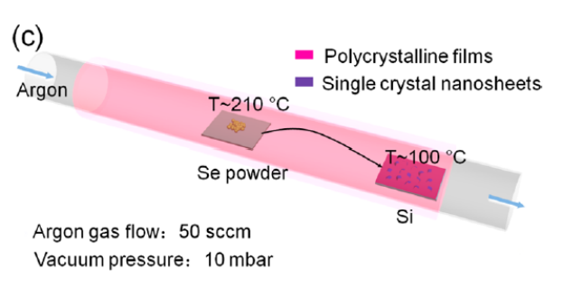

/*************************************************************************
 * @File Name: CVD_Synthesis_of_Se_Fil.md
 * @Description: 
 * @Author: Xuejing Wang 
 * @Created Time: Fri 11 Jul 2025 10:13:52 AM CST
 ************************************************************************/

# Synthesis of Se film:

**Reference: Small 2022, 18, 2202523; ACS Nano 2017, 11, 10222-10229**

## Pre-CVD growth:

**Substrate clean**: ultrasonic clean acetone + IPA each 3 mins, O plasma treatment for 30s. 

## Method

1. Weight ***10 mg*** Se (selenium powder) inside quartz/ceramic boat
2. Put the Se boat at ***center*** of the tube
3. 285nm SiO2/(001) Si substrate on another boat, located downstream ***15 cm*** away from Se boat 
4. Before growth, **pump chamber down to $2.8\times 10^{-2}$ mbar** and purge with high purity N2 first flowed at **150 sccm for 5~15 mins** to remove the air in tube
5. During growth, ***300***$\degree C$ ***(ramping time 20 mins), holds for 180 mins***, N2 flow rate ***50 sccm***
6. After growth, cool down.

> 粉末舟与衬底舟摆放位置参考：

