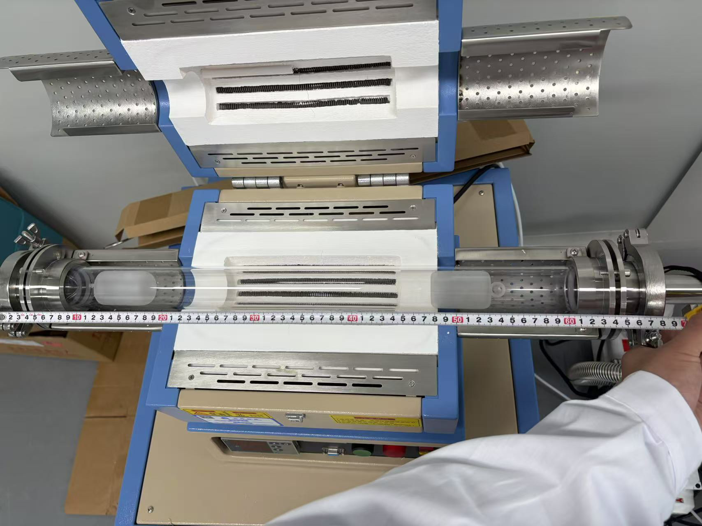
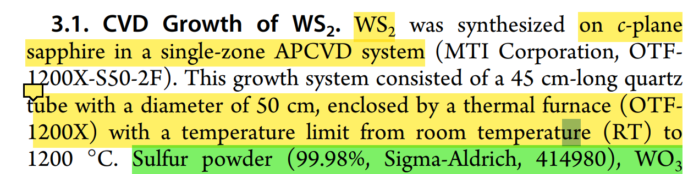
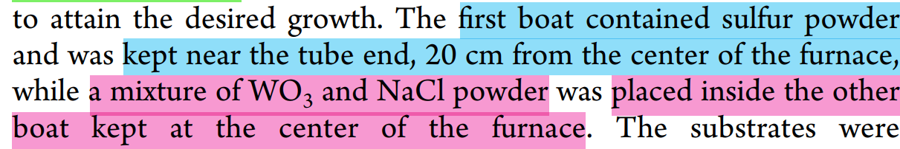
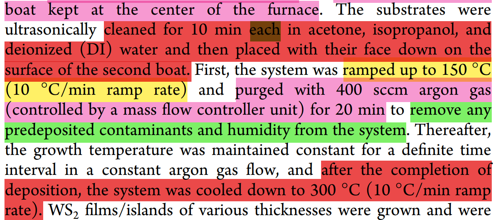
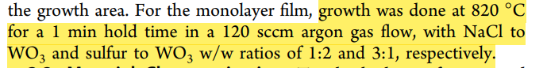

/*************************************************************************
 * @File Name: README.md
 * @Description: Project Documentation
 * @Author: SevensZhu
 * @Created Time: Fri 11 Jul 2025 11:39:23 AM CST
 ************************************************************************/

**说明**：

- 我们的管式炉的石英管参数和论文里的不太一样，管径是一样的50mm，但是长度我们是近70cm，他们是45cm，需要重新测量温度，通过温度校订石英舟的位置	

- 文献石英舟距离参数

- 这篇文章有个问题，其substrate是c-plane sapphire，我们的是285nm SiO2/(001) Si substrate

- 这篇文章有一些速率类参数和具体温度参数，可以参考

    - 准备操作

        
    
    - 生长温度和原料比例（但是原料的具体数值未给，只给了ratio（比例））
    
    
    
    

Method：

1. Weigh 
