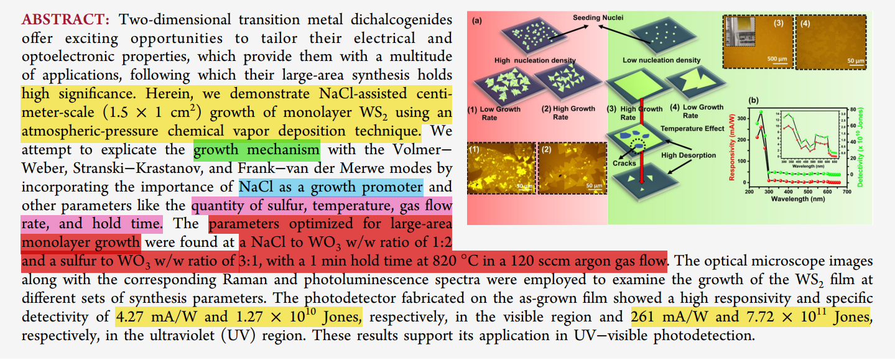

/*************************************************************************
 * @File Name: README.md
 * @Description: Project Documentation
 * @Author: SevensZhu
 * @Created Time: Fri 11 Jul 2025 10:46:36 AM CST
 ************************************************************************/
  这些论文均为老师提供的

为寻找方便，对这些论文做一些注解：

1. 第一篇论文: 主要关注在$NaCl$ 粉末辅助$WO_3$ 和硫磺，通过化学气相合成，合成$WS_2$ 的薄层二维材料。最后通过拉曼光谱，PLUV技术检验晶膜质量。

    

2. 
