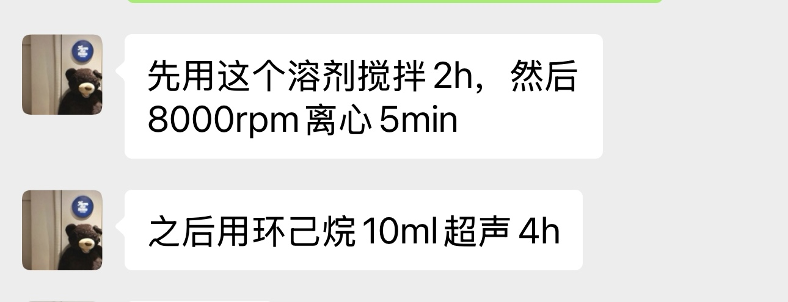
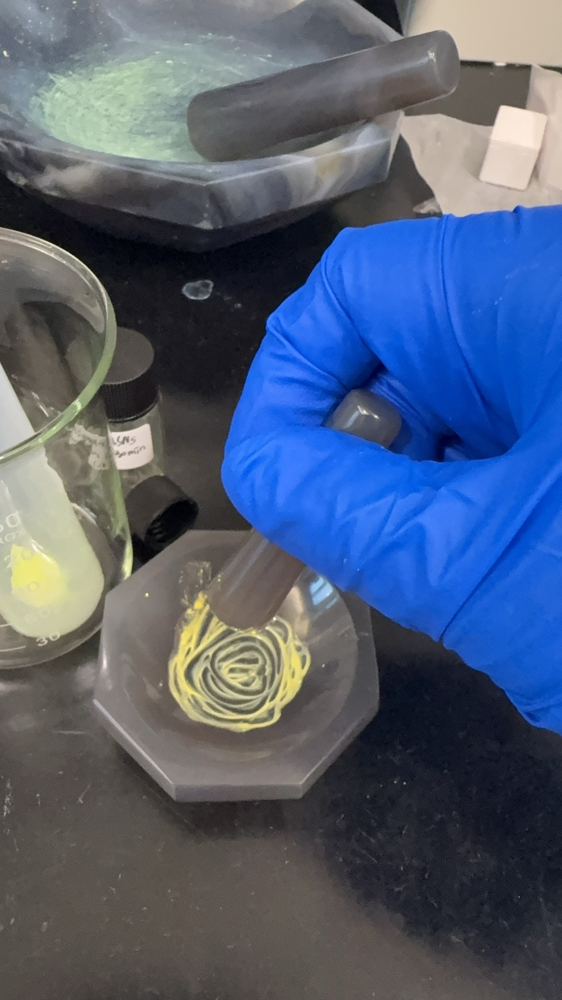
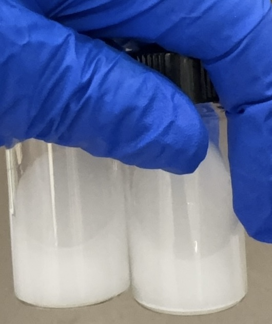

# $h-BN$ 的剥离与分散实验记录

## 2025.8.13

### 实验步骤

做了两管，各10ml，按照配方

1. h-BN 20mg
2. OAm: 0.5ml 
3. ODE: 1ml
4. 环己烷: 8.5ml

由于粉末附着在离心管壁，摇晃至管壁无明显沉淀后，超声3.5h

- 后使用超声好的10ml/20mg hBN中滴加2ml量子点溶液，400r搅拌12h，10000r 离心10min，放入真空干燥柜一下午，获得粉末
    - 粉末刮下来与光胶混合，做器件，将材料制成粉末（15mg）与1滴光胶混合研磨，涂覆在小灯器件上,在紫外灯下照半小时，5v 0.2A 通电

### 出现的问题

1. 未良好控制超声温度，现用密封袋做了冰块替换

    超声使用规范：

    1. 单次超声尽可能不要超过30min，绝对不要超过1h，否则里面的二极管会断裂
    2. 每三十分钟要休息5-10分钟

2. 实验离心后出现hBN和量子点分离，未良好融合，且油酸难以挥发，粉末湿度较大，现改进

    

    

3. 研磨颜色参考：

    

光胶滴多了，只要滴一滴即可

4. 紫外照射时间过长，导致量子点失效，30min变成15min

## 8.14 8.15

### 实验

原配方依旧，将混合液体搅拌两小时

然后8000r离心5min，用10ml环己烷溶解

超声四个小时

### 出现的问题

1. 超声30分钟后，hBN会沉淀，需要摇匀

    