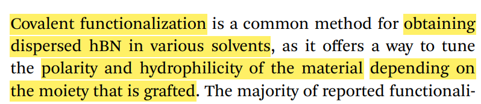
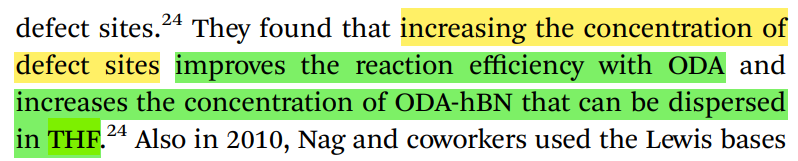
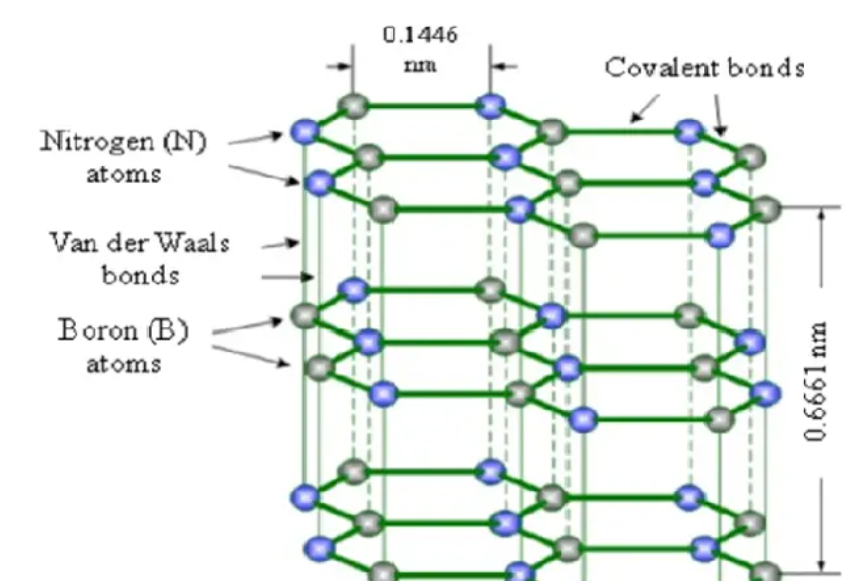

/*************************************************************************
 * @File Name: README.md
 * @Description: notes
 * @Author: Sevens Zhu
 * @Created Time: Thu Jul 17 12:39:29 2025
 ************************************************************************/

# 摘要

## 实验目的

将$hBN$良好分散在与量子点相同的非极性溶剂中

## 理论基础

1. 量子点与$hBN$ 混合：量子点器件在工作时，随着温度升高，光电转化效率下降。通过$hBN$的优异散热性能（减少温度升高对113量子点的影响）、层间载流子传输性能（提高113量子点内部电子的跃迁效率）来提升$CsPbBr_3$量子点的光学性能。

2. 通过超声分离(solvent-assisted liquid exfoliation): 

3. 共价官能团化（Covalent functionalization）：

    

