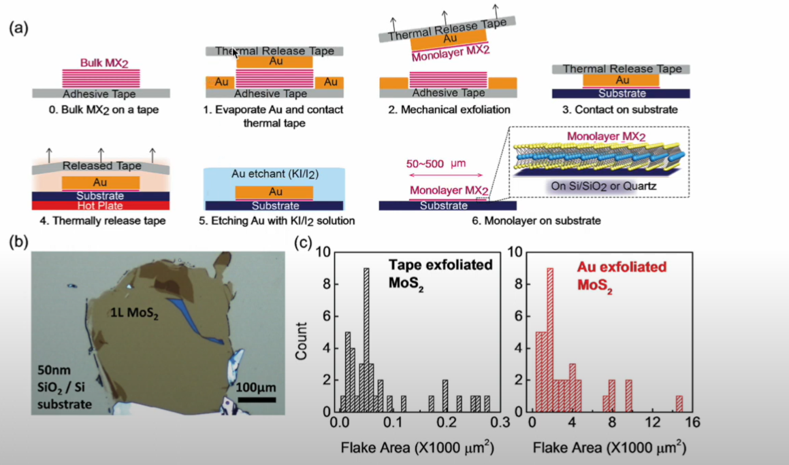

# Universal mechanical exfoliation of large-area 2D crystal

## 1.1 Basic goal

use a conramination-free, one -step and universal Au-assisted mechanical exfolation method (can isolate 40 types of single-crystalline monolayers.(most of them are of milimetre-size and high-quality))

